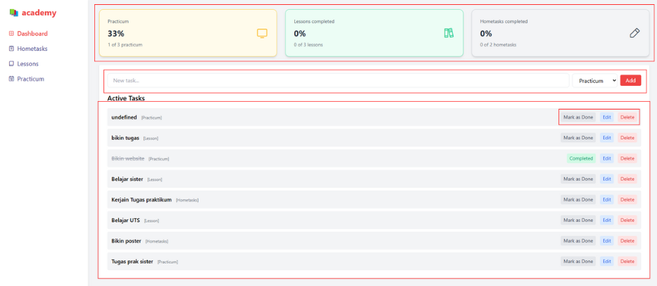
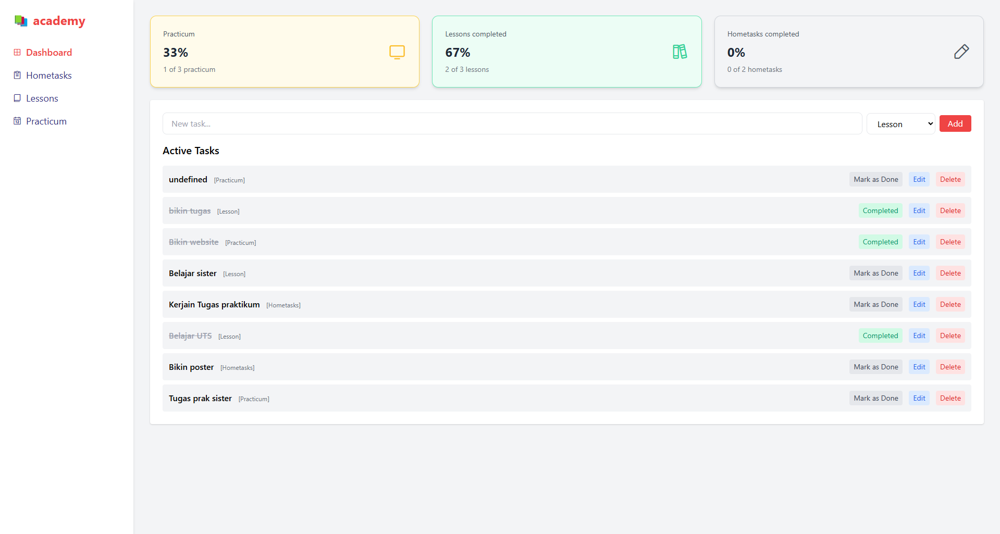
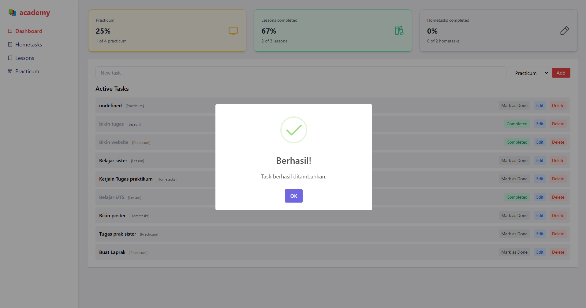
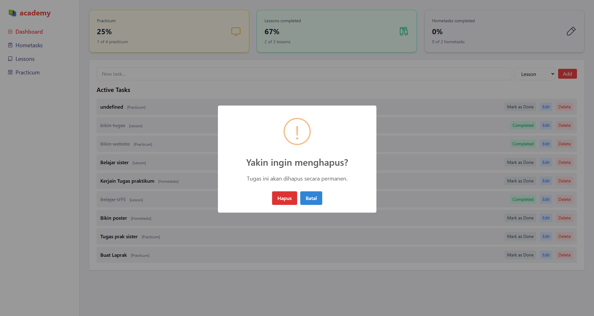

# 🎓 Student Task Dashboard

Aplikasi ini adalah sebuah dashboard sederhana yang dibangun untuk membantu mahasiswa dalam mencatat, mengelola, dan memantau progres tugas mereka. Website sederhana ini dibangun menggunakan HTML, Tailwind CSS, dan JavaScript ES6+. Aplikasi ini terdapat beberapa fitur-fitur yang bermanfaat seperti menambahkan tugas baru, mengedit detail tugas, menandai tugas yang sudah selesai, dan menghapus tugas berdasarkan kategori tertentu. Dengan desain yang minimalis dan user friendly, aplikasi ini bisa mempermudah mahasiswa untuk mengorganisasi tugas-tugas kuliah secara lebih terstruktur.

## Fitur Aplikasi



- Menambahkan tugas baru dengan memilih kategori (Lesson, Hometasks, Practicum)
- Menandai tugas sebagai selesai
- Mengedit dan menghapus tugas menggunakan SweetAlert
- Statistik progres per kategori secara real-time
- Data disimpan di localStorage agar tetap tersimpan saat refresh halaman
- Notifikasi sukses ketika tugas ditambahkan

## Screenshot Aplikasi





## Fitur ES6+ yang Diimplementasikan

- `let` dan `const` untuk deklarasi variabel
- **Arrow Functions**:
  - `const renderTasks = () => { ... }`
  - `const addTask = () => { ... }`
  - dan beberapa fungsi lainnya
- **Template Literals** untuk rendering konten dinamis:
  ```js
  li.innerHTML = `
    <span class="font-medium ${task.status === 'Completed' ? 'line-through' : ''}">${task.text}</span>
  `;