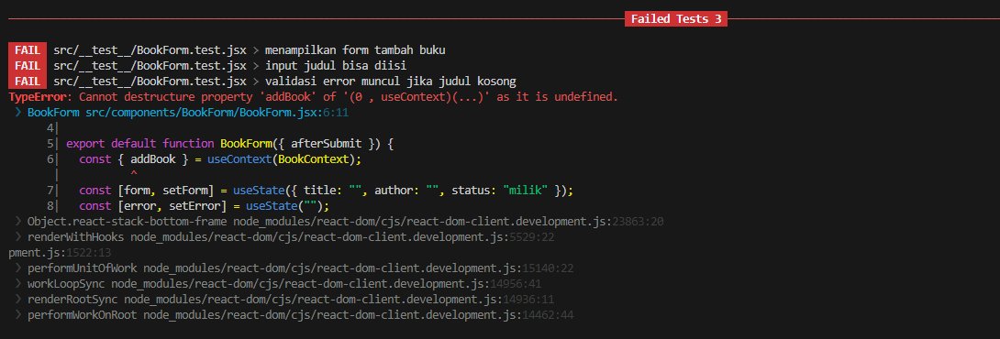

# BookFlix – Aplikasi Manajemen Buku Pribadi (Netflix Style)

BookFlix merupakan sebuah website manajemen buku yang dibuat menggunakan teknologi React JS dan Tailwind CSS, dengan tampilan seperti Netflix. website ini memungkinkan pengguna mencatat, mencari, memfilter, serta mengelola daftar buku yang dimiliki, sedang dibaca, atau ingin dibeli.

---

## Fitur Utama

- Menambah buku baru (judul, penulis, status, dan gambar cover)
- Mengedit dan menghapus buku
- Filter buku berdasarkan status (milik, baca, beli)
- Pencarian buku secara real-time
- Penyimpanan data ke `localStorage`
- Modal form interaktif untuk tambah buku
- Slider koleksi buku bergaya Netflix
- Validasi form
- Gambar tersimpan dalam format base64
- Unit testing dengan React Testing Library

---

## Cara Instalasi & Menjalankan

1. **Clone repository:**
git clone https://github.com/namamu/bookflix.git
cd bookflix

2. **Clone repository:**
git clone https://github.com/namamu/bookflix.git
cd bookflix

3. **Jalanin aplikasi:**
npm run dev

---

## Screenshot User Interface Website

1. **Home Page:**

2. **Static Page:**

3. **Tambah Buku Popup:**

---

## Fitur React yang digunakan

| Fitur             | Implementasi                                |
|------------------|----------------------------------------------|
| `useState`       | Mengatur state form, filter, dan pencarian   |
| `useEffect`      | Sinkronisasi data ke localStorage            |
| `useContext`     | Global state via Context API (`BookContext`) |
| Custom Hook      | `useLocalStorage`, `useBookStats`            |
| React Router     | Navigasi antar halaman Home & Stats          |
| PropTypes        | Validasi tipe props komponen                 |

---

## Laporan Testing

Berikut adalah hasil testing yang telah dilakukan :

